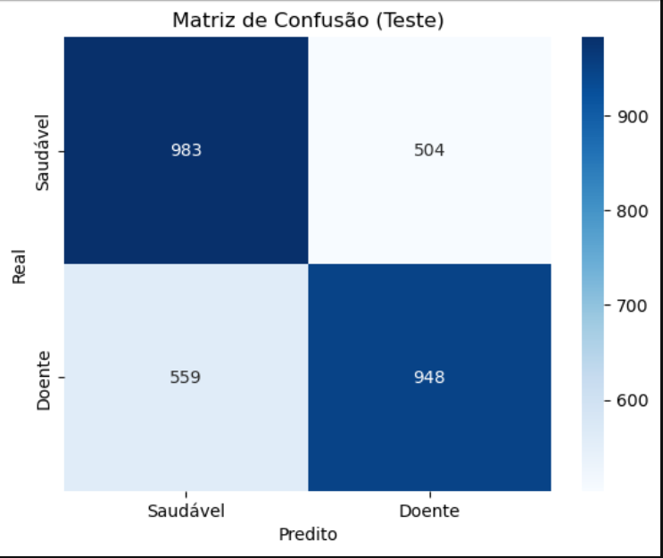

# 🫀 Cardiovascular Risk Predictor  

**Projeto de Machine Learning para prever risco de doenças cardiovasculares com base em dados clínicos.**  

## 📌 Visão Geral  
Este projeto utiliza um modelo de machine learning (Regressão Logística) para prever a presença de doenças cardiovasculares com base em variáveis como idade, colesterol, peso e hábitos de vida.  

**Desempenho do Modelo**:  
- **Acurácia**: 64%  
- **AUC-ROC**: 0.70  
- **F1-Score**: 0.63  

## 🛠️ Tecnologias  
- Jupyter Notebook  
- Bibliotecas: Pandas, Scikit-learn, Matplotlib, Seaborn  

## 📊 Dados  
O dataset contém 10.000 registros com as seguintes variáveis:  
- **Variáveis clínicas**: Idade, colesterol, glicose, etc.  
- **Target**: `cardio_disease` (0 = saudável, 1 = doente).  

**Pré-processamento**:  
- Tratamento de outliers (altura, peso).  
- Padronização das features.  

## 📈 Métricas e Resultados  
### Matriz de Confusão  
  

### Curva ROC  
  

**Principais Insights**:  
- Idade e colesterol são as variáveis mais relevantes.  
- O modelo tem dificuldade em identificar verdadeiros positivos (Recall baixo).  

## 🚀 Como Executar  
1. Clone o repositório:  
   ```bash  
   git clone https://github.com/seu-usuario/cardio-risk-predictor.git  
